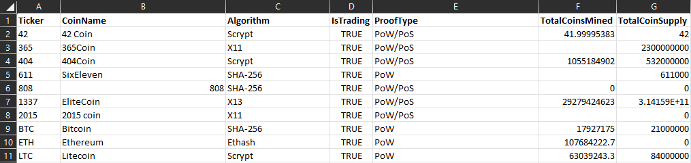
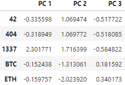
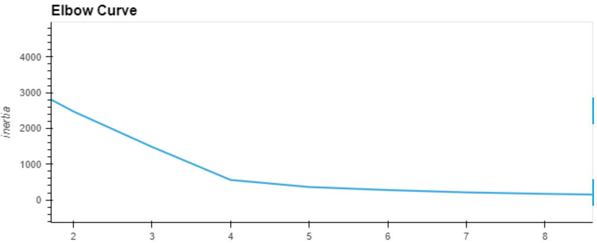
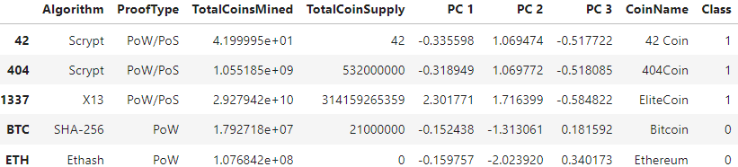
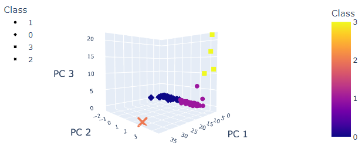
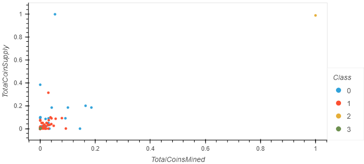

# Cryptocurrency Analysis

## Project Overview
A prominent investment bank is interested in offering a new cryptocurrency investment portfolio for its customers. They have requested a report that includes:

* what cryptocurrencies are on the trading market; and 
* how they can be grouped to create a classification system.

Since there is no known output, we have decided to use ```unsupervised learning``` to group the cryptocurrencies by clustering algorithms. We also use data visualizations to share our findings with the board.

### Data set
The primary input for analysis is ```crypto_data.csv```, a file that includes
- currency names and stock tickers
- mining algorithms employed (X11, SHA-256)
- whether the coin is traded or not
- total coin supply 
- blockchain proof types 
    - *PoW (Proof of Work)*: requires miners to solve complex mathematical puzzles in order to validate transactions
    - *PoS (Proof of Stake)*: requires validators to stake collateral based on the number of coins owned
    - *hybrid model*



### Algorithms used
* ```K-means```: an unsupervised learning algorithm that finds structure in unlabeled data
* ```Principal Component Analysis (PCA)```: dimensionality reduction that simplifies complex data

### Libraries used

* Pandas: a Python library used for data munging 
* Scikit-learn: an ML algorithm library that integrates with NumPy and SciPy
* Plotly: a graphing library that makes interactive, publication-quality charts
* Hvplot: a high-level plotting library that uses HolovViews and Bokeh

## Data Processing

By creating a new DataFrame that prioritizes numerical data, we can feed this to machine learning models for analysis. 

1. Read in the data:  
```file_path = "crypto_data.csv"```   
```df_crypto = pd.read_csv(file_path, index_col=0)```

2. Clean the data:

    - Keep traded currencies:  
    ```df_crypto = df_crypto.loc[df_crypto['IsTrading']==True]```   
    ```df_crypto.drop(columns=['IsTrading'], inplace=True)```
    - Remove rows with null values   
    ```df_crypto = df_crypto.dropna()```

3. Encode the data, converting unique values to integers:
```df_crypto_dummies = pd.get_dummies(df_crypto, columns=['Algorithm', 'ProofType'])```

4. Scale for Principal Component Analysis (PCA). This prevents skewing towards variables on larger scales:  
```crypto_scaled = StandardScaler().fit_transform(df_crypto_dummies)```

### Reduce Data Dimensions
By removing less informative, 'noisy' variables we can focus on components that explain the most variance in the data. 

1. Use PCA to reduce dimensions to three principal components:  
```pca = PCA(n_components=3)```   
```crypto_pca = pca.fit_transform(crypto_scaled)```

2. Create a dataframe with the three principal components:  
```df_crypto_pca = pd.DataFrame(data=crypto_pca, ```   
```columns=['PC 1', 'PC 2', 'PC 3'],```   
```index=df_crypto.index)```



## Analysis

1. Create an elbow curve to determine the *k-value*, which determines the ideal number of clusters, i.e. the point of diminishing returns for modeling and explaining variance in the data:

```
inertia = []
k = list(range(1, 11))
for i in k:
    km = KMeans(n_clusters=i, random_state=0)
    km.fit(df_crypto_pca)
    inertia.append(km.inertia_)

elbow_data = {'k': k, 'inertia': inertia}
df_elbow = pd.DataFrame(elbow_data)
df_elbow.hvplot.line(x='k', y='inertia', xticks=k, title= 'Elbow Curve')
```


The k-value seems to be around 4.

2. Create a comprehensive dataset to analyze the original features of the cryptocurrencies with the new clustering classes:

```clustered_df = pd.concat([df_crypto, df_crypto_pca], axis = 1)```   
```clustered_df['CoinName'] = coin_name_df['CoinName']```  
```clustered_df['Class'] = predictions```


Each currency now has associated cluster values and class values from 0-3.

3. Create a 3D scatter plot to show the effective separation of clustered data by PCA. 

```
fig = px.scatter_3d(clustered_df,
                    x="PC 1",
                    y="PC 2",
                    z="PC 3",
                    color="Class",
                    symbol="Class",
                    hover_name ='CoinName',
                    hover_data=['Algorithm'],
                    width=800)

fig.update_layout(legend=dict(x=0, y=1))
fig.show()
```
    
The positioning of the points suggests a degree of similarity within clusters: points that are closer are more similar to each other. There also appears to be one cluster (Class 2, yellow markers) that is well-separated from the others, indicating a group of cryptocurrencies with distinct features. 

4. Plot Total Coin Supply and Total Coins Mined

```scaled_data = clustered_df[['TotalCoinSupply', 'TotalCoinsMined']]```
```scaled_and_clustered = MinMaxScaler().fit_transform(scaled_data)```
```scaled_and_clustered_df = pd.DataFrame(scaled_and_clustered, columns=['TotalCoinSupply', 'TotalCoinsMined'], index=clustered_df.index)```

Add 'CoinName' and 'Class' columns  
```scaled_and_clustered_df['CoinName'] = clustered_df['CoinName']```
```scaled_and_clustered_df['Class'] = clustered_df['Class']```

Create scatter plot with x="TotalCoinsMined" and y="TotalCoinSupply":

```
scaled_and_clustered_df.hvplot.scatter(x='TotalCoinsMined',
                                       y='TotalCoinSupply',
                                       by='Class',
                                       hover_cols = 'CoinName')
```

  
The 2D scatter plot shows that most cryptocurrencies are clustered towards the lower left corner, indicating smaller values for both total coin supply and total coins mined. A few outliers may be of interest to investors. 

# Summary

A total of 532 tradable cryptocurrencies were analyzed and compared across four clusters, giving investors a more precise way to classify and invest their funds. 